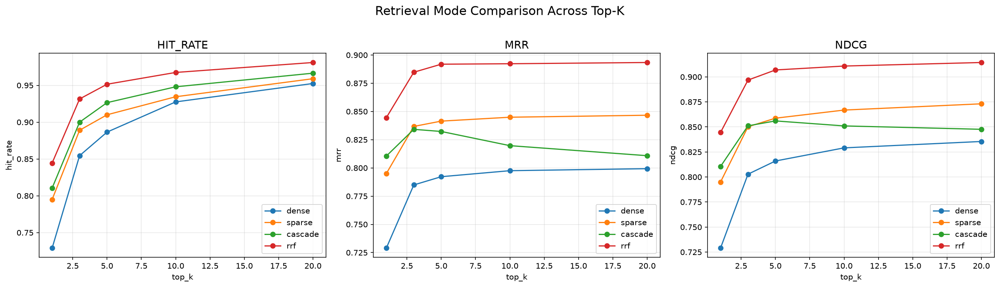
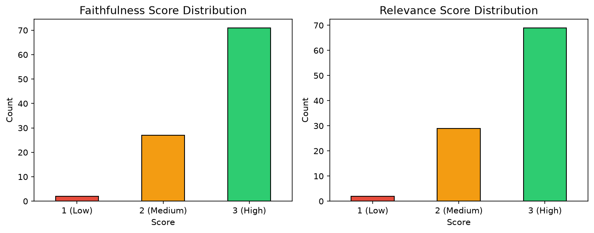

# Arxiv Research Assistant

ArXiv Research Assistant is an end-to-end RAG pipeline that synthesizes recent deep learning research from ArXiv into conversational answers. It uses reciprocal rank fusion (RRF) over a vector database, with a full evaluation harness measuring retrieval quality and answer faithfulness + relevance. At present, it contains 1000 arxiv papers between 2026-06-11 and 2026-06-17.

The project includes a four-mode retrieval ablation study comparing dense, sparse, cascade, and reciprocal rank fusion (RRF) retrieval across five top-k settings, plus an LLM-as-judge evaluation measuring answer faithfulness and relevance.

**An experiment was performed, and RRF hybrid retrieval achieves MRR 0.885 and nDCG 0.897 at top-k=3, outperforming pure dense (0.785 / 0.803), sparse (0.837 / 0.850), and cascade (0.834 / 0.851) retrieval on 2,000 synthetic queries across a 400 paper subsample of the full corpus.**

## Tech Stack

- **Qdrant**: vector store with native hybrid search and RRF fusion
- **fastembed**: local dense and sparse embedding (jina-v2-small, BM25)
- **Groq**: fast LLM inference for generation and judging
- **Pydantic**: schema validation with range-checked judge scores
- **tenacity**: exponential-backoff retry on rate limits
- **Streamlit**: UI
- **GitHub Actions**: CI (ruff + pytest) and HF Space sync

## Architecture

- **Data source:** arXiv API (cs.AI, up to 1,000 most recently submitted papers.)
- **Vector database:** Qdrant Cloud with hybrid dense (jina-embeddings-v2-small-en) + sparse (BM25) indexing
- **Retrieval:** Serving uses RRF (Reciprocal Rank Fusion) at top-k=3. Experiment uses four modes: dense-only, sparse-only, cascade (sparse prefetch -> dense rerank), and RRF.
- **Generation:** Groq-hosted LLMs via an OpenAI-compatible client with exponential-backoff retry on rate limits
- **Serving:** Streamlit UI on Hugging Face Spaces

## Try It

**[Live Demo →](https://huggingface.co/spaces/Nicholas-Nevan-Kurniawan/Arxiv-rag)**

Select a provider and model in the sidebar, then ask about recent AI research. The system retrieves relevant papers via RRF and synthesizes an answer.

## Development Setup

For reproducing experiments or running locally:

```bash
git clone https://github.com/<your-username>/arxiv-rag.git
cd arxiv-rag
cp .env.example .env
uv sync
```

Required environment variables (in `.env`):
- `GROQ_API_KEY`: [get one here](https://console.groq.com/keys)
- `QDRANT_API_KEY`: from a [Qdrant Cloud](https://cloud.qdrant.io/) cluster
- `QDRANT_CLUSTER_ENDPOINT`: your cluster's URL

Populate the vector database and launch:
```bash
python -m pipeline.ingestion
python -m scripts.rebuild_collection
uv run streamlit run app/app.py
```

## Project Structure

```
pipeline/           # ingestion from arXiv API and RAG query logic
evaluation/         # search metrics (hit rate, MRR, nDCG) and LLM-as-judge
clients/            # VectorDB and LLM client wrappers
schemas/            # Pydantic data models (ArxivDocument, JudgementRecord, etc.)
generate_data/      # ground truth generation, response generation, corpus subsampling
analysis/           # experiment analysis and chart generation
scripts/            # collection rebuild, ground truth validation, overlap measurement
tests/              # pytest tests for retrieval metric functions
app/                # Streamlit serving UI
config/             # paths and model configuration
```

## Experimental Section
### Key Findings
#### Retrieval comparison (4 modes × 5 top-k values)



---
**Hit Rate**

| top_k | Dense | Sparse | Cascade | RRF |
|-------|-------|--------|---------|-----|
| 1 | 0.729 | 0.795 | 0.811 | 0.845 |
| 3 | 0.855 | 0.889 | 0.900 | 0.932 |
| 5 | 0.887 | 0.910 | 0.927 | 0.952 |
| 10 | 0.928 | 0.935 | 0.948 | 0.968 |
| 20 | 0.953 | 0.959 | 0.967 | 0.981 |
---
**MRR**

| top_k | Dense | Sparse | Cascade | RRF |
|-------|-------|--------|---------|-----|
| 1 | 0.729 | 0.795 | 0.811 | 0.845 |
| 3 | 0.785 | 0.837 | 0.834 | 0.885 |
| 5 | 0.792 | 0.841 | 0.832 | 0.892 |
| 10 | 0.798 | 0.845 | 0.820 | 0.892 |
| 20 | 0.799 | 0.847 | 0.811 | 0.893 |
---
**nDCG**

| top_k | Dense | Sparse | Cascade | RRF |
|-------|-------|--------|---------|-----|
| 1 | 0.729 | 0.795 | 0.811 | 0.845 |
| 3 | 0.803 | 0.850 | 0.851 | 0.897 |
| 5 | 0.816 | 0.859 | 0.856 | 0.907 |
| 10 | 0.829 | 0.867 | 0.851 | 0.911 |
| 20 | 0.835 | 0.873 | 0.848 | 0.914 |
---
- RRF dominates across all settings and metrics.
- Sparse outranks dense on this scientific-text corpus, consistent with exact-vocabulary matching favoring lexical retrieval on jargon-dense abstracts.
- Cascade trades ranking for recall: hit rate improves with wider prefetch, but MRR and nDCG decline. The wider candidate pool adds correct hits at lower positions without lifting them to the top.
- MRR saturates by top-k ≈ 5: past that point, wider retrieval adds recall without improving ranking quality. Serving is done at top-k=3, chosen as the cost/quality operating point just before the plateau.

#### Response evaluation (LLM-as-judge)

100 RAG responses judged for faithfulness and relevance on a 1-3 scale by a cross-family judge (gpt-oss-120b at temperature 0 judging llama-3.3-70b outputs at default provider temperature 1.0 (chosen to increase phrasing diversity)).



Faithfulness is high (the system rarely hallucinates beyond retrieved context) but is a weak discriminator. Summarization-style RAG is inherently faithful because it restates what it's given. Relevance is more informative in comparison, because mixed scores trace directly to fixed top-k retrieval without relevance filtering, where weakly-relevant retrieved papers dilute the answer.

### Evaluation Methodology

**Ground truth:** 400 papers subsampled (seed=1) from the 1,000-paper corpus. For each paper, 5 retrieval questions were generated by qwen3-32b at provider default temperature 1.0 with reasoning disabled, framed as information needs a researcher would type *before* knowing the paper exists (no coined method names, no abstract paraphrase, to produce realistic search queries). Ground truth frozen for subsequent experiments.

**Retrieval evaluation:** 2,000 questions × 4 modes × 5 top-k values = 40,000 Qdrant searches, scored with hit rate, MRR, and nDCG. Single-document relevance labels were used, where each question has one correct paper. MAP was omitted because it collapses to MRR under single-document relevance.

**Response evaluation:** 100-item subset, one question per paper. Responses generated by llama-3.3-70b-versatile, then judged by gpt-oss-120b (a larger, different-family model to reduce self-preference bias) at temperature 0 with reasoning effort set to low. Faithfulness measures grounding in retrieved context, and relevance measures whether the response answers the question. Scores validated by manual spot-check of judge verdicts.

### Known Limitations

- **Single-document relevance labels.** Each question has one correct paper. Multi-document graded relevance would make nDCG more meaningful but requires labeling that's infeasible for an unbounded synthesis corpus, so the single-label scheme is the more feasible choice. Multi-document graded relevance would also make the MAP metric feasible.
- **No relevance filtering.** Fixed top-k retrieval feeds all k documents to the generator regardless of relevance score. Weakly-relevant papers dilute answers, which is the primary driver of mixed relevance scores. Score thresholding or cross-encoder reranking with a cutoff would address this.
- **Faithfulness saturates.** On summarization-style RAG, faithfulness is a necessary metric, but not fully informative on its own as the generator restates retrieved content by design, making the task trivial. Claim-level decomposition would be a more granular alternative.
- **Latency not measured.** Retrieval latency was not benchmarked. From a remote client, wall-clock is dominated by network round-trip. Isolating per-method server-side cost would require a co-located client or local deployment.

### Reproducing the Experiments

Steps 3, 6, and 7 are rate-limited on Groq's free tier and may require multiple invocations across daily resets. The idempotent resume logic in each script handles this automatically.

```
1. python -m pipeline.ingestion                          # Fetch papers from arXiv
2. python -m generate_data.eval_subsample                # Sample 400 papers for ground truth
3. python -m generate_data.search_ground_truth            # Generate retrieval questions (qwen3-32b)
4. python -m scripts.rebuild_collection                   # Upsert to Qdrant
5. python -m evaluation.search_evaluation                 # Run the 4×5 retrieval sweep
6. python -m generate_data.response_evaluation_subset_generation  # Sample 100 for response eval
7. python -m generate_data.generate_responses             # Generate RAG answers (llama-3.3-70b)
8. python -m evaluation.llm_as_judge                      # Run faithfulness + relevance judges (gpt-oss-120b)
9. python -m analysis.analyze_experiment_results           # Produce tables and charts
```